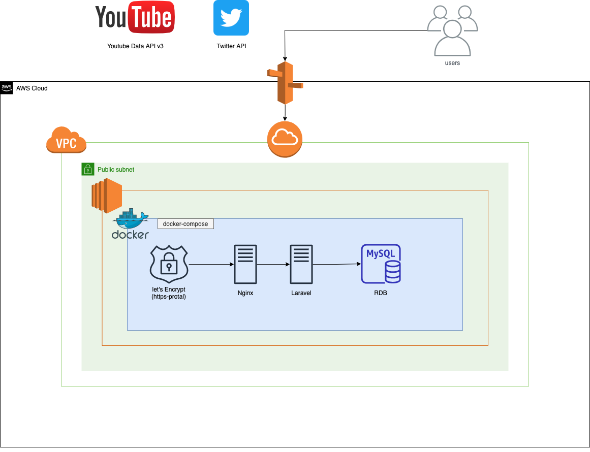
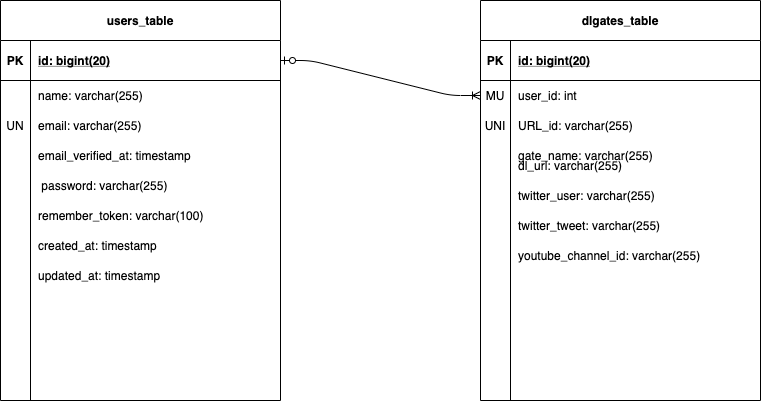
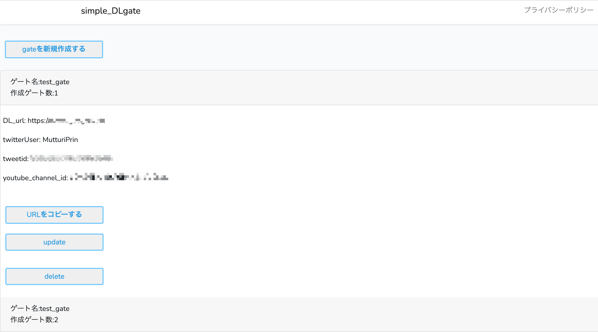
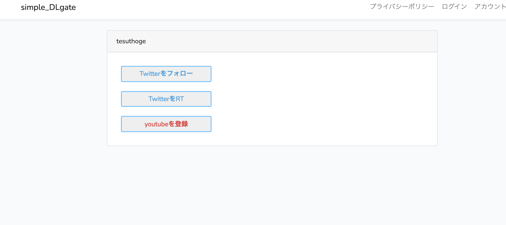
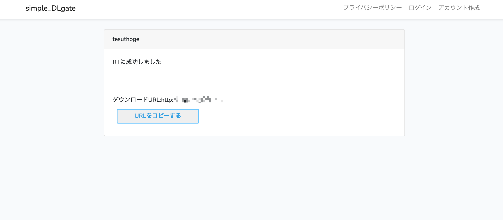

# simple_dlgate
**ダウンロードゲートを生成するwebアプリ**
 https://dlgate-jp.cyou 

## Introduction - the project's aim

各種SNSサービスのフォロー、RT、いいねを引き換えにダウンロードリンクを無料で提供できるサービスです

## Technologies

* FrontEnd
  * vue.js 2.6.12
  * HTML/CSS/bootstrap
* BackEnd
  * laravel 6.18.43
  * composer 1.10.19 
  * PHPUnit 8.5.8
  * laravel/dusk 6.9.1
  * TwitterAPI (laravel/socialite v5.0.1)
  * Youtube Data API (google/auth v1.14.2) (trunks07/youtube-laravel-api)
* infra
  * Docker 19.03.13
  * docker-compose 1.27.4
  * AWS(EC2, Route53, VPC, IAM)
  
  
  
## Imprementions
* ユーザー情報編集、退会機能　(今後も実装する可能性があるのでパッケージ化しました)
* laravel/Duskを用いたブラウザテスト
* PHPUnitを用いた単体テスト、HTTPリクエスト単位のテスト
* TwitterAPI,YoutubeDataAPI連携
* DLgateの新規作成、一覧表示、編集、削除機能
  * 各入力フォームのバリデーション
  
* UUIDを用いたgate別の動的パス生成
  * Sessionを駆使し twitterのフォロー、いいね、youtubeの登録に成功した場合にダウンロードURLを提供
  
  
## AWS

## ER-Diagram

  
### Table description
| table | description |
|:-:|:-:|
| users  | 登録ユーザー情報  |
|  dlgates | ユーザーが作成したゲート情報  |

## Usage
Gateの新規作成方法は当アプリに記載されているのでそちらをご確認ください
https://dlgate-jp.cyou

1.ログインしgate作成後、URLをコピーをクリックするとクリップボードにコピーされます

2.あなたのデータを必要としているユーザーへURLを送付します。
 
3.送付されたURLにユーザーがアクセスするとgateで登録した各種snsリダイレクト用のボタンが生成されます

4.登録した各種snsにリソースへのアクセスが完了したら、登録したダウンロードリンクが生成されダウンロードが可能となります

## To-do
* PHP-CS-Fixerの導入
* キャメルケースとスネークケースが混じっていて統一されてないので修正
* テストのカバレッジ (網羅率)を測定／分析
* 単体、HTTPリクエスト単位、ブラウザテストの追加実装
* ci/cdを用いた自動化テスト＆デプロイ
* dlgate-jp.cyou/DLgate/view?id=(uuid)ページにてレスポンスを返す際に１秒程度要する
  * そのため原因究明が必要※(予測としてsessionの生成に時間がかかっている？　クエリ時にUUIDで選択、射影しているため？)
* dlgate-jp.cyou/DLgate/view?id=(uuid)でスーパーリロード機能を実装
* +privateな記事投稿機能実装
* +youtubeチャンネルの登録、twitterアカウントへいいねを引き換えに記事閲覧権限を付与する機能

