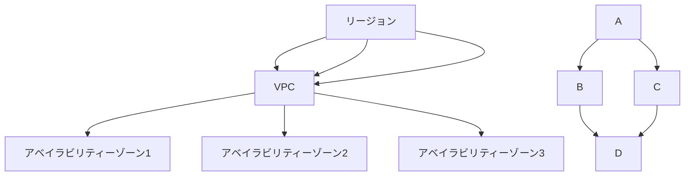
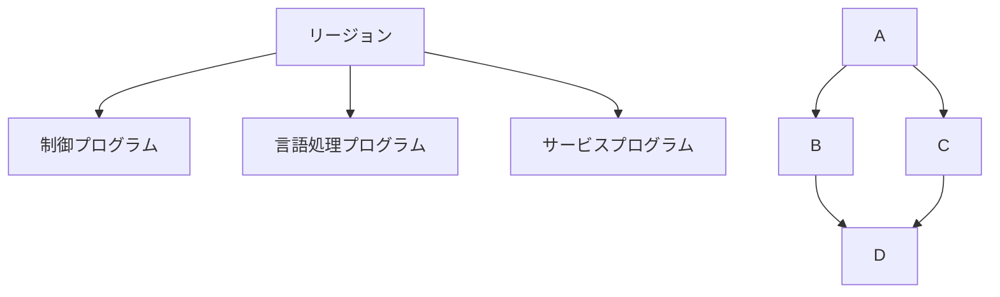

```mermaid
graph TB


リージョン-->VPC-->アベイラビリティーゾーン1
リージョン-->VPC-->アベイラビリティーゾーン2
リージョン-->VPC-->アベイラビリティーゾーン3

A-->B;
A-->C;
B-->D;
C-->D;

```
リージョン　AWSの物理データサーバーのこと
アベイラビリティーゾーン それぞれリージョン地域の中で独立したデータセンターのこと

```mermaid
graph TB


リージョン-->制御プログラム
リージョン-->言語処理プログラム
リージョン-->サービスプログラム

A-->B;
A-->C;
B-->D;
C-->D;

```