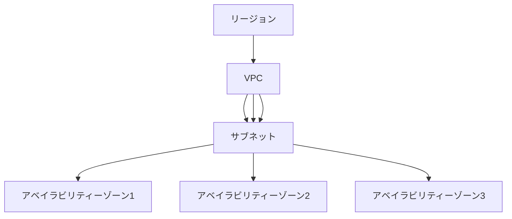
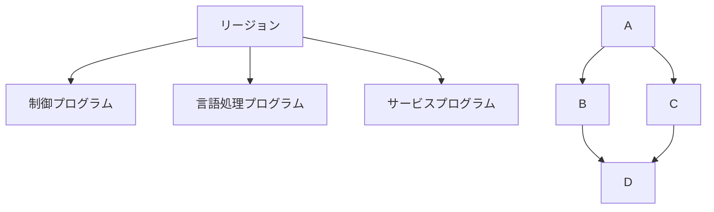

```mermaid
graph TB


リージョン-->VPC-->サブネット-->アベイラビリティーゾーン1
VPC-->サブネット-->アベイラビリティーゾーン2
VPC-->サブネット-->アベイラビリティーゾーン3


```
リージョン　AWSの物理データサーバーのこと
アベイラビリティーゾーン それぞれリージョン地域の中で独立したデータセンターのこと
VPC 仮想ネットワーク
サブネット　仮想ネットワークを細分化(仮想ネットワークがマンションでサブネットがマンションの部屋)

```mermaid
graph TB


リージョン-->制御プログラム
リージョン-->言語処理プログラム
リージョン-->サービスプログラム

A-->B;
A-->C;
B-->D;
C-->D;

```